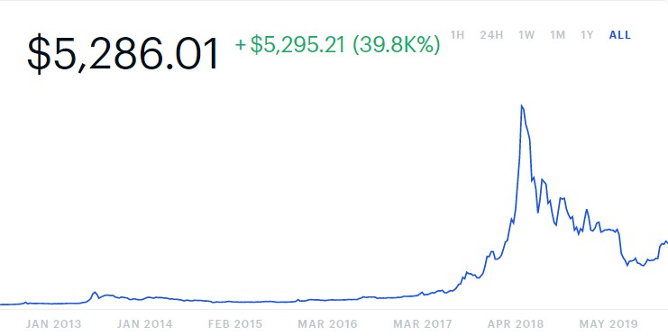

# Social platform attention, sentiment and Bitcoin price volatility

## 1. Introduction

Bitcoin is the first public digital currency and created in 2009. Bitcoin is the most popular digital currency. Bitcoin is well-known to the public 4 years after its creation when it reached $1,000 in December, 2013. From 2014 to the very beginning of 2017, the price of Bitcoin fluctuate between $200-$1,000. According to existing research, Bitcoin's value is much more volatile than fiat currencies like USD, EURO, GBP and Japanese Yen. The extreme volatility reduces the probability of Bitcoin to be an ideal currency. Furthermore, Bitcoin's price and its attention on social platform increased sharply during the year 2017. The price peaked in Decemer 2017, with the highest price exceeding $20,000. However, the price dramatically plummeted over 50% in 2 months after it reached the peak. Most time in February 2018, Bitcoin price is below $10,000. Now the price of Bitcoin is about $5,200. Figure 1 shows the price trend since 2013.

Figure 1 Bitcoin price since 2013
