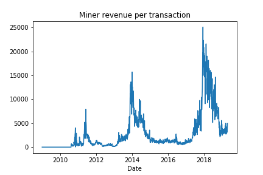

# Social platform attention, sentiment and Bitcoin price volatility

## 1. Introduction

Bitcoin is the first public digital currency and created in 2009. Bitcoin is the most popular digital currency. Bitcoin is well-known to the public 4 years after its creation when it reached $1,000 in December 2013. From 2014 to the very beginning of 2017, the price of Bitcoin fluctuated between $200-$1,000. According to existing research, Bitcoin's value is much more volatile than fiat currencies like USD, EURO, GBP and Japanese Yen. The extreme volatility reduces the probability of Bitcoin to be an ideal currency. Furthermore, Bitcoin's price and its attention on the social platform increased sharply during the year 2017. The price peaked in December 2017, with the highest price exceeding $20,000. However, the price dramatically plummeted over 50% in 2 months after it reached its peak. Most time in February 2018, the Bitcoin price is below $10,000. Now the price of Bitcoin is about $5,200. Figure 1 shows the price over the 5 years.

Figure 1 Bitcoin price (Source: blockchain.com)

As a speculative asset, social platform attention reflects how popular Bitcoin is. Intuitively, when people are optimistic about Bitcoin, the probability of an increase in Bitcoin price is higher due to speculative buying. Besides, more information release about Bitcoin can attract incremental capital. Investors who are not familiar with Bitcoins start to buy such a "Currency" because of information overload. Figure 2 shows the Google trends in the past 5 years.

Figure 2 Google trends of Bitcoin (Source: [Google trends](https://trends.google.com/trends/explore?date=today%205-y&q=bitcoin))

## 2. Literature Review

The existing literature has done extensive research on the impact of Twitter, Google trends, etc. on Bitcoin price. For example, Mai et al. (2015) find that the numbers of bullish and bearish tweets by all users have negligible effects on bitcoin returns in the next hour. Matta et al. (2015) use Google trends to analyze Bitcoin’s popularity under the perspective of Web search. Their cross-correlation analysis between Bitcoin price and Google trends yields positively significant and substantial results. Thus, Google trends can be seen as a predictor for Bitcoin price. Georgoula et al. (2015) treat Tweets sentiment as the independent variable and use ordinary least squares model to analyze the impact of sentiment on Bitcoin price formation. The sentiment analysis is conducted through support vector machines, which classifies the sentiment. Their findings also support the argument that high public recognition or interest in Bitcoins increases their market price.

Apart from the price level, the volatility of Bitcoin is increasingly attracting academia. Bukovina and Marticek (2016) decompose Bitcoin price into two parts: rational and less rational components. They examine the sentiment as a driver of Bitcoin volatility and find that positive sentiment influences much more on Bitcoin volatility. Stenqvist and Lönnö (2017) analyze 2.27 million Bitcoin-related tweets to examine the relationship between sentiment fluctuation and price change in the very near future. They use different time intervals to test the correlation and find that shorter intervals (5 mins and 15 mins) produce more predictions, with sentiment change of 2%.

The existing paper mainly focuses on the shock to the price level, with only a few considering purely the volatility. However, the transaction is so active that the absolute price level is less important than volatility, especially for the high-frequency trading of Bitcoins futures. Historically, few of the literature analyze the soar of Bitcoin price in 2017. Further, Bitcoin is still a speculative asset, implying longterm holders face a much higher risk. This is partly the reason for high transactions volume now. This paper uses the sentiment as the single factor to model Bitcoin price and its volatility.

## 3. Methodology

In the following parts, the BTC price is decomposed into two parts, as the following formula shows:

$ BTC = t/k*R $

where BTC the price of one bitcoin, *t* is an average amount of transactions, *k* is a "coefficient" - the miners’ reward per one block 2 and R is the average revenue per transaction. This decomposition defines the rational and less rational components of Bitcoins valuation (Bukovina & Marticek, 2016). T/k ratio (average number of transactions per block) captures the rational part. It reflects Bitcoin fundamentals - the supply and demand relationship within the Bitcoin virtual economy. Every newly mined block represents a new supply of bitcoins and the number of transactions represents the demand for bitcoins as a medium of exchange within the Bitcoin “market”. Figure 3 shows the average number of transactions per block. Obviously, the volatility of Bitcoin price is sharply increasing since 2015. The highest fluctuation emerges in recent 2 years.

Figure 3 Bitcoin price (Source: blockchain.com)

The second part *R* in the above decomposition is miner revenue per transaction (transaction fees). To some extent, it measures the less-rational factor such as speculative trade, i.e., the sentiment. Investors buy and hold Bitcoins for the sake of value increase or hedging the real world risk like fiat currency depreciation. Miners thus have the incentive to do mining jobs. Figure 4 shows the mines' revenue per transaction (MRPT) since 2009. This is calculated by the following formula

$ MRPT=miners' revenue per block/transactions per block $

where the numerator and denominator data are offered by blockchian.com.

Figure 4 Miners' revenue per transaction (Source: blockchain.com)

### 3.1 Data

The decomposition of Bitcoin price indicates that we need two kinds of data, one is transactions per block and the other is sentiment data. The former can be downloaded from blockchain.com. While [Sentdex](http://sentdex.com/financial-analysis/?i=BTCUSD&tf=all) offers the visualized sentiment analysis of Bitcoin. From the figure below, we can see the short-term sentiment remain the same fluctuation pattern in the past years.

Figure 5 Sentdex sentiment of Bitcoins

### 3.2 Model

Bitcoin and sentiment can be modeled through the autoregressive model with one-period lag.

The augmented AR(1), so-called AR(X) model includes one more explanatory variable - sentiment.

In both formulae, *Revenue* represents miners' revenue per transaction as defined in Section 3. Previously, Saxa (2014) uses this method to forecast mortgages. Given the distinct volatility in different periods, estimation should be divided into several windows. The *sentiment* is defined in three ways: positive, negative and cumulative.

## 4 Results

The estimation of the AR(1) model for the whole period shows that the coefficient is about 0.940 with a significance level of 1%.

Due to availability of sentiment data(see the sentiment figure above, there are many missing data). I compared the estimation results of different periods shown in Bukovina & Marticek (2016), which follows Saxa (2014).

Figure 6 Estimation of revenue on sentiment (December 2013 - December 2014)

As Fig. 6 shows, the difference of R-squares between the two models (AR(1) vs AR(X)) is trivial. The extra explanatory - the sentiment proxy is statistically significant but economically negligible. One possible reason is that long-term sentiment can be absorbed, especially for the cumulative measure. The negative part almost accounts for nothing new. Thus, we are interested in the relationship in the short-term. To some extent, it takes some time to fully mitigate short-term sentimental shock. And the difference in R-square should be large. Short-term windows estimation is shown in Figure 7.

Figure 7 Estimation of revenue on sentiment (December 2013 - March 2014)

Fig. 7 illustrates that while the coefficient in the AR(1) model is almost the same, the increment of R_square is indeed larger. The result also shows the little explanatory power of negative sentiment, which is consistent with the results from one year period estimation (See Fig. 6). 

This interesting finding may suggest that pure attention or sentiment of Bitcoin strengthen people's expectation, thus leading to high volatility. The negative sentiment, however, explains too little, partly due to the small amount of information. For example, any bad real-world news can lead to an increase of Bitcoin price if investors want to hedge risk. The spill-over effect and externality in return reinforce such a scenario. This may increase the trading volume and volatility due to heterogeneous expectations among market participants. But the converse may not hold. If there is no bad news in the real world in some periods, it's hard to say that Bitcoin investors are in a bad mood. The sentiment structure is asymmetric, i.e., it's more common to observe positive sentiment. So is the cumulative.

## 5. Conclusion

This project simply replicates existing literature and compare present arguments and findings. The popular measure - Tweets and google trends are good indicators for prediction. The single factor of sentiment can also capture a small amount of volatility. The small increment in R_square is determined by the quality of the data. In this project, the sentiment is extracted from reddit.com, thus underrepresenting the overall sentiment. Irrespective of the absolute magnitudes, the findings are similar to existing research using Tweets and google trends to analyzing attention/sentiment. The main limitation stems from low data availability. The following study can focus on the asymmetric sentiment shock structure. The disparity of good news and bad news towards Bitcoins is an interesting point.

## Reference

* Bukovina, J., & Marticek, M. (2016). Sentiment and bitcoin volatility (No. 2016-58). Mendel University in Brno, Faculty of Business and Economics.
* Georgoula, I., Pournarakis, D., Bilanakos, C., Sotiropoulos, D., & Giaglis, G. M. (2015). Using time-series and sentiment analysis to detect the determinants of bitcoin prices. *Available at SSRN 2607167*.
* Li, T. R., Chamrajnagar, A. S., Fong, X. R., Rizik, N. R., & Fu, F. (2018). Sentiment-based prediction of alternative cryptocurrency price fluctuations using gradient boosting tree model. *arXiv preprint arXiv:1805.00558*.
* Matta, M., Lunesu, I., & Marchesi, M. (2015, June). Bitcoin Spread Prediction Using Social and Web Search Media. In UMAP Workshops (pp. 1-10).
* Mai, F., Shan, Z., Bai, Q., Wang, X., & Chiang, R. H. (2018). How does social media impact Bitcoin value? A test of the silent majority hypothesis. *Journal of Management Information Systems*, 35(1), 19-52.
* Saxa, B. (2015). Forecasting mortgages: internet search data as a proxy for mortgage credit demand. *NATIONAL BANK OF THE REPUBLIC OF MACEDONIA*, 107.
* Stenqvist, E., & Lönnö, J. (2017). Predicting Bitcoin price fluctuation with Twitter sentiment analysis.

## Appendix

* Data used in this project are saved in [data](data) folder.
* Figure 1-4 are plotted via python matplotlib package. See the [code](visualization.ipynb) and [dependencies](requirements.txt). Run `$ python -m pip install -r requirements.txt` in terminal to install the dependencies if necessary.
* All figures shown in this project are saved in [images](images) folder.
